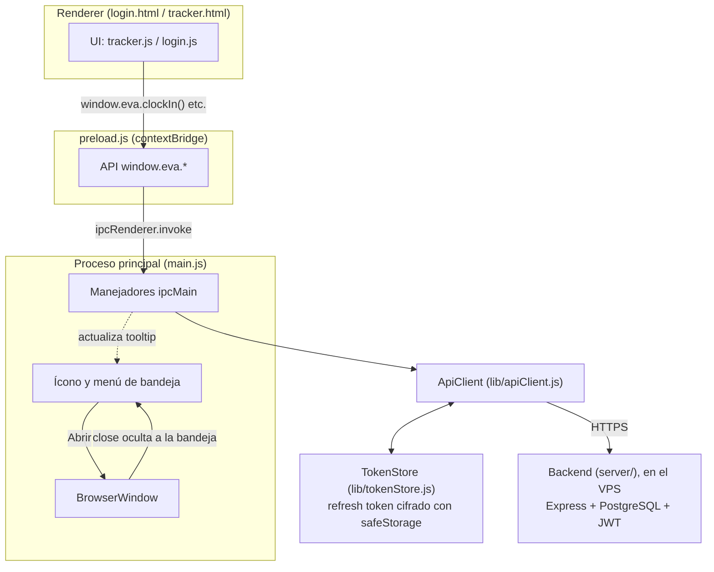
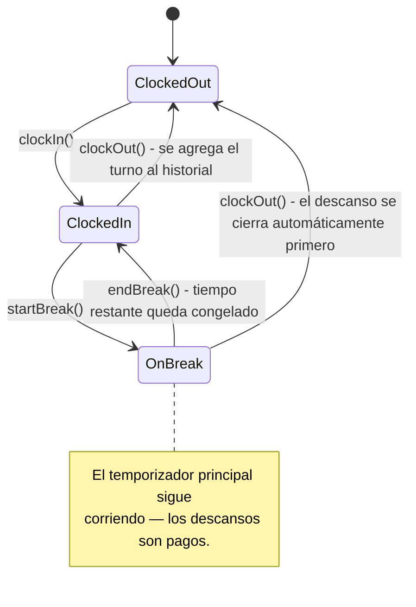

# EVA Tracker

Un control de horario de escritorio, ligero, construido para **Elite VA Consulting**, hecho con Electron. Esta es la v1: entrada/salida (clock in/out), descansos pagos e historial de turnos. Más funcionalidades (proyectos, reportes, un backend sincronizado) están planeadas a medida que el producto crece.

## Funcionalidades

- **Clock in / Clock out** — un solo botón, con un temporizador `HH:MM:SS` que corre desde el momento en que se marca la entrada.
- **Descansos pagos** — cada turno tiene una asignación de descanso por defecto de 60 minutos. Al terminar un descanso, el tiempo restante queda congelado en lugar de reiniciarse; solo al marcar salida (y empezar un nuevo turno) se reinicia la asignación. El temporizador principal nunca se detiene durante un descanso, ya que ese tiempo es pago.
- **Historial de turnos** — cuando un turno termina (clock out), se agrega al historial como una sola tarjeta: fecha, duración total y el rango de horas de entrada-salida. Los turnos en curso no aparecen hasta que se cierran, y los descansos quedan intencionalmente fuera de esta vista.
- **Corre en segundo plano** — cerrar la ventana minimiza EVA Tracker a la bandeja del sistema (system tray) en lugar de cerrarlo. Sigue registrando el tiempo hasta que se elige "Quit" desde el menú de la bandeja. El tooltip de la bandeja muestra en vivo el estado (Clocked In / Clocked Out).
- **Inicio de sesión con usuario y contraseña** — autentica contra el backend (`server/`) alojado en el VPS, con tokens JWT de corta duración y renovación automática en segundo plano.

## Capturas de pantalla

| Login | Registrando tiempo | En descanso |
|---|---|---|
| Nombre + correo, sin contraseña | Temporizador grande, día/fecha, historial de turnos | Cuenta regresiva del descanso, congelada hasta el clock out |

*(Agregar capturas de pantalla aquí una vez que la interfaz esté definitiva.)*

## Cómo está construido



No hay ningún servicio corriendo por separado en segundo plano dentro de la app de escritorio — cuando la app se minimiza a la bandeja, el proceso de Electron simplemente sigue ahí, sin ventana visible, hasta que se elige Quit. El "temporizador" que se ve tampoco es un contador que corre en memoria todo el tiempo: es pura aritmética de reloj (`Date.now() - marcaDeTiempoDelClockIn`) calculada de nuevo cada vez que la interfaz se actualiza, así que cerrar y volver a abrir la app (o incluso poner la máquina a dormir) no pierde ni pausa el tiempo transcurrido — solo un clock out explícito lo hace.

Los datos de fichajes viven en PostgreSQL en el backend (`server/`), no en el disco del usuario. `ApiClient` (`lib/apiClient.js`) expone los mismos métodos que el antiguo almacenamiento local en JSON (`getStatus`, `clockIn`, `clockOut`, `startBreak`, `endBreak`, `getShifts`, ...), así que `main.js` y el renderer no necesitaron cambios más allá de intercambiar la implementación.

## Backend (`server/`)

API en Node.js/Express + PostgreSQL, autenticación con JWT (access token de 15 min + refresh token opaco rotado en cada uso). Esquema de dos tablas (`server/db/schema.sql`): `users` (perfil, credenciales, rol, horario esperado de entrada/salida, asignación de descanso) y `shifts` (un registro por turno, con `clock_in`/`clock_out`/tiempo de descanso acumulado — un índice único impide más de un turno abierto por usuario). Endpoints: `/api/auth/*` (login, refresh, logout), `/api/time/*` y `/api/break/*` (empleados), `/api/admin/*` (solo rol admin: listar/crear empleados, resumen del día con quién llegó tarde o se demoró en salir, export CSV).

El backend está desplegado en el VPS (`2.25.117.230`), expuesto en HTTPS a través de Caddy usando el dominio gratuito `2.25.117.230.nip.io` (Caddy gestiona el certificado de Let's Encrypt solo, sin necesidad de un dominio propio). `lib/config.js` ya apunta ahí. Ver `server/.env.example` para las variables de entorno requeridas.

El panel de administrador vive dentro de la propia app de escritorio (botón "Admin panel" en `tracker.html`, visible solo si el usuario tiene rol `admin`) — no es una página web aparte. La creación de empleados se hace por terminal contra el VPS, no desde la app:

```sh
# 1. El primer admin se inserta directo en Postgres (no hay ningún admin
#    todavía para llamar al endpoint protegido). El hash se genera una vez:
node -e "console.log(require('bcryptjs').hashSync('la-contraseña-real', 12))"
# y con ese hash:
psql "$DATABASE_URL" -c "INSERT INTO users (name, email, password_hash, role, scheduled_clock_in, scheduled_clock_out) VALUES ('Nombre Admin', 'admin@ejemplo.com', '<hash>', 'admin', '09:00', '18:00');"

# 2. De ahí en adelante, cualquier empleado nuevo se crea con una sola llamada
#    autenticada como ese admin (el servidor calcula el hash, no hace falta hacerlo a mano):
curl -X POST https://2.25.117.230.nip.io/api/admin/employees \
  -H "Authorization: Bearer <access-token-del-admin>" \
  -H "Content-Type: application/json" \
  -d '{"name":"...","email":"...","password":"...","role":"employee","scheduledClockIn":"09:00","scheduledClockOut":"18:00"}'
```

## Estados de clock y descanso



## Estructura del proyecto

```
main.js                    Proceso principal de Electron: ventana, bandeja, manejadores IPC
preload.js                 contextBridge — expone window.eva.* al renderer
lib/
  dataStore.js             Almacenamiento local en JSON + lógica de negocio
src/
  login.html, login.js     Pantalla de nombre + correo
  tracker.html, tracker.js Temporizador, control de descansos, historial de turnos
  styles.css               Tema blanco / negro / #9d7026, tipografía Poppins
  assets/
    icon-mark.svg          Ícono fuente usado para generar los íconos de la app y la bandeja
    logo.svg               Logo completo (usado en la pantalla de login)
    tray-icon.png          Ícono de bandeja generado (32px, a partir de icon-mark.svg)
build/
  icon.ico                 Ícono de Windows generado (16/32/48/256px, a partir de icon-mark.svg)
```

Los datos viven fuera del repositorio, en la carpeta de datos de usuario propia de cada sistema operativo (en Windows: `%APPDATA%\eva-tracker\eva-tracker-data.json`) — un archivo JSON con el usuario actual y un registro plano de entradas `in` / `out` / `break_start` / `break_end`.

## Cómo empezar

```bash
npm install
npm start
```

Requiere Node.js y npm. Electron es una dependencia de desarrollo y se instala junto con todo lo demás.

## Generar el instalador

```bash
npm run dist
```

Genera un instalador de Windows en `dist/EVA Tracker Setup <versión>.exe` (electron-builder + NSIS). El build no está firmado (no hay certificado de firma de código configurado), así que Windows SmartScreen puede mostrar una advertencia la primera vez que se ejecute — eso es esperado para un build interno/sin firmar.

> **Detalle específico de Windows:** el paso de empaquetado NSIS de electron-builder necesita extraer un archivo auxiliar que contiene symlinks, lo cual requiere tener el **Modo de desarrollador** activado (Configuración → Privacidad y seguridad → Para desarrolladores) o ejecutar el build desde una terminal **elevada (Administrador)**. Es un ajuste de entorno de una sola vez, no un error del proyecto.

`dist/` está en `.gitignore` — el instalador es un artefacto de build, no algo que se deba subir al repositorio. Se puede regenerar en cualquier momento con el comando de arriba.

## Regenerar los íconos de la app y la bandeja

`build/icon.ico` y `src/assets/tray-icon.png` se generan a partir de `src/assets/icon-mark.svg`. A propósito no hay un script de build para esto en el repositorio — es una conversión puntual, que se vuelve a hacer a mano (o pidiéndole ayuda a quien esté colaborando en el código) cada vez que el ícono fuente cambie.

## Roadmap

Esta es intencionalmente una v1 delgada. Ya construido: backend real (Postgres + Express + JWT) reemplazando el almacenamiento local en JSON, con cuentas de múltiples usuarios y roles (empleado/admin). Próximos pasos conocidos, todavía no construidos:
- CI/CD para desplegar `server/` automáticamente al hacer push (hoy el despliegue al VPS es manual).
- Proyectos/etiquetas por cada registro de tiempo.
- Reportes más ricos (hoy el export de admin es CSV plano).
- Detección de inactividad o niveles de actividad, si esto necesita competir con herramientas como Hubstaff/Insightful en ese aspecto.
